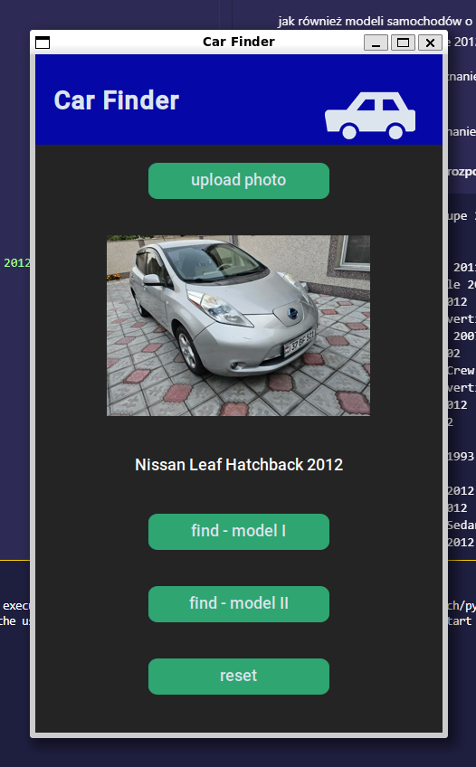
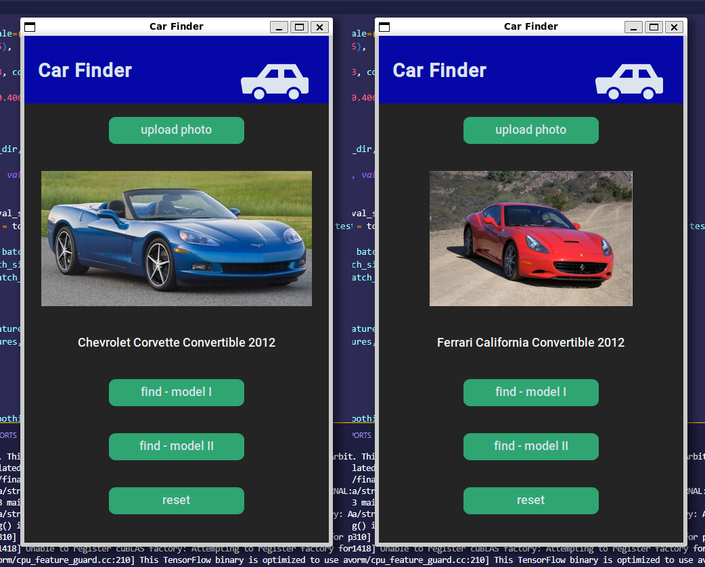
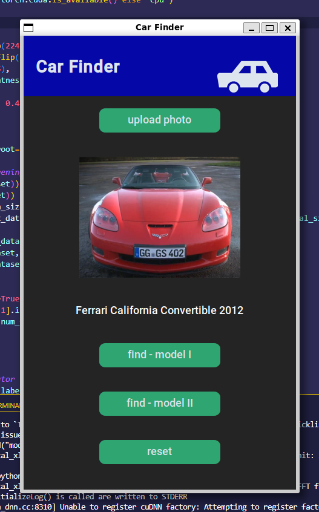
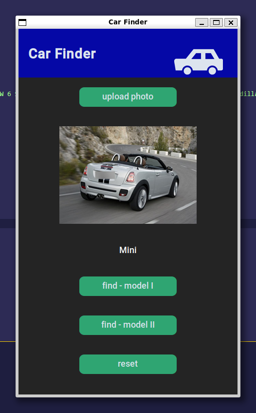
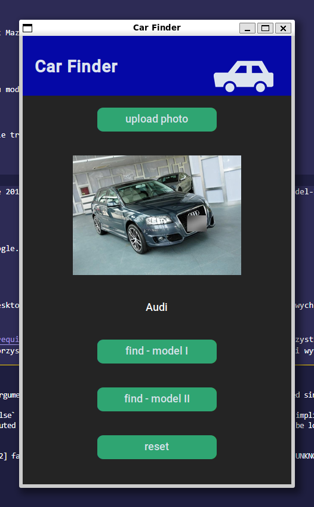
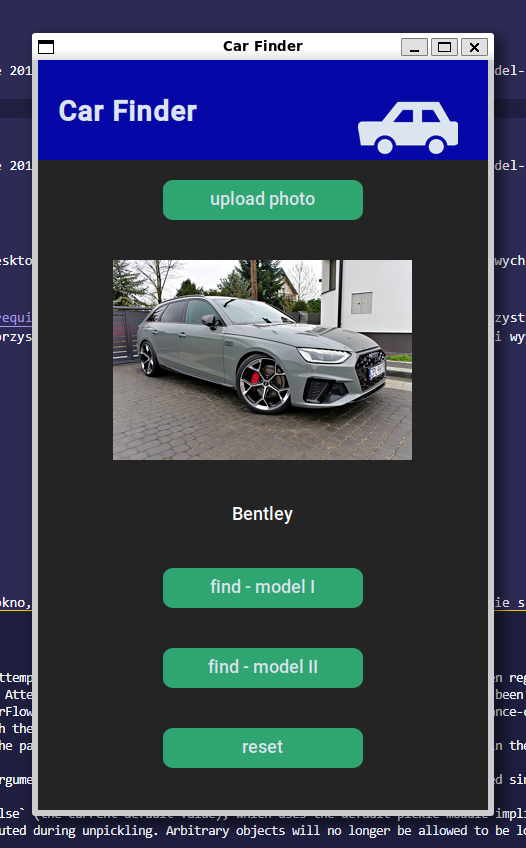
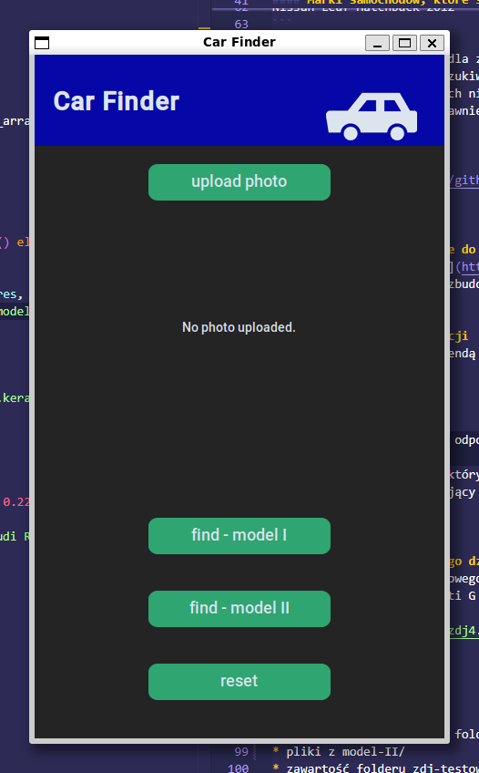
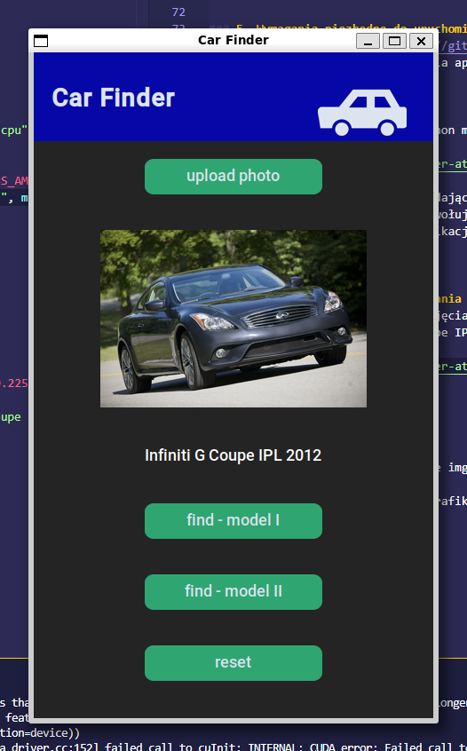
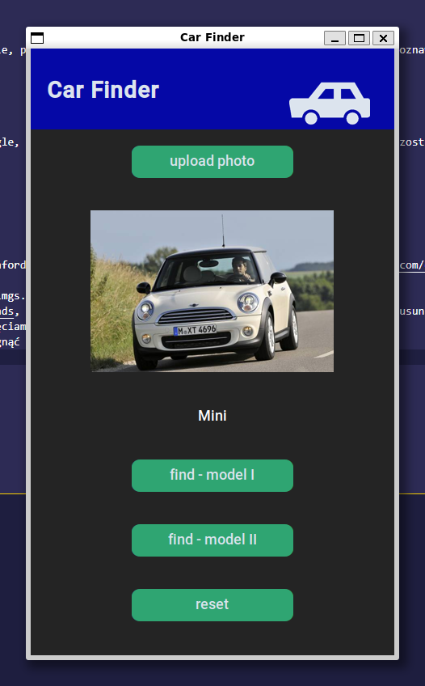

# Klasyfikacja obiektów - wykrywanie modeli samochodów na postawie zdjęć .jpg


### 1. Założenia projektu
Projekt polegał na zrobieniu aplikacji desktopowej, która na podstawie załadowanego przez użytkownika zdjęcia samochodu w formacie .jpg dopasuje go do jednej z określonych wcześniej, w zestawie użytym do wytrenowania danego modelu, marek samochodów.

Aplikacja została w całości napisana w języku programowania Python. Można wyróżnić w niej 3 główne części: 
* **GUI** wykorzystujące moduły customtkinter, tkinter
* **model I PyTorch** stworzona przy użyciu modułów torch oraz torchvision
* **model II Keras** z wykorzystaniem API tensorflow.keras.


### 2. Podział pracy
* Anna Nowak - GUI, dokumentacja, testy manualne
* Emil Gruszecki - trenowanie modelu II, dokumentacja, testy manualne
* Sebastian Zarębski - trenowanie modelu I, dokumentacja, testy manualne


### 3. [Model I](https://github.com/dzikieAppusy/AO_IS5/tree/main/model-I)
Model I udało się wytrenować do dokładności treningowej około 93%, walidacyjnej oraz testowej w granicach 88-90%. Model I, oparty na sieci neuronowej MobileNetV2, ma właśnie taką dokładność. Model przyjmuje obrazy RGB o stałym wymiarze 224x224 piksele, dlatego też przed jego zastosowaniem rozmiar testowanego obrazu musi zostać dostosowany do wymaganych wymiarów. Model sprawdza dobrze w przypadku samochodów o bardzo charakterystycznym wyglądzie, takich jak przykładowo Nissan Leaf Hatchback 2012,

<p align="center">
  
  <br />
  Zdjęcie 1. Poprawne rozpoznanie zdjęcia modelu Nissan Leaf Hatchback 2012, źródło obrazu Grafika Google.
</p>

jak również modeli samochodów o wyglądzie bardziej zbliżonym, np. model potrafi rozróżnić ze stosunkowo wysoką poprawnością Chevrolet Corvette Convertible 2012 oraz Ferrari California Convertible 2012. 

<p align="center">
  
  <br />
  Zdjęcie 2. Poprawne rozpoznanie zdjęć modeli Chevrolet Corvette Convertible 2012 oraz Ferrari California Convertible 2012, źródło obrazu model-I/imgs_zip/cars_train.
</p>
<p align="center">
  
  <br />
  Zdjęcie 3. Błędne rozpoznanie zdjęcia modelu Chevrolet Corvette Convertible 2012, źródło obrazu model-I/imgs_zip/cars_train.
</p>

#### Modele samochodów, które są rozpoznawane przez model I
```
Aston Martin Virage Coupe 2012
Audi R8 Coupe 2012
Audi TTS Coupe 2012
Bentley Mulsanne Sedan 2011
BMW 6 Series Convertible 2007
Cadillac CTS-V Sedan 2012
Chevrolet Corvette Convertible 2012
Chevrolet Malibu Sedan 2007
Daewoo Nubira Wagon 2002
Dodge Ram Pickup 3500 Crew Cab 2010
Ferrari California Convertible 2012
FIAT 500 Convertible 2012
Fisker Karma Sedan 2012
Ford Focus Sedan 2007
Geo Metro Convertible 1993
GMC Savana Van 2012
Honda Odyssey Minivan 2012
Infiniti G Coupe IPL 2012
Mercedes-Benz C-Class Sedan 2012
Nissan Leaf Hatchback 2012
```

Program działa poprawnie dla znacznej większości danych znajdujących się w folderze imgs_zip/cars_train, oraz dla niektórych zdjęć wypisanych powyżej modeli pochodzących z wyszukiwarki Grafiki Google. Nie uda się natomiast uzyskać pozytywnego rezultatu jeżeli wykorzystamy zdjęcie modelu auta, którego rozpoznawania model PyTorch nie został nauczony. W przypadku użycia jakiegokolwiek zdjęcia niezwiązanego z modelami aut obiekt przedstawiony na zdjęciu również nie zostanie poprawnie rozpoznany.


### 4. [Model II](https://github.com/dzikieAppusy/AO_IS5/tree/main/model-II)
Model II jest drugim podejściem do wytrenowania modelu rozpoznającego markę samochodu. Pierwsza wersja zakładała rozpoznanie marki, modelu, oraz roku produkcji samochodu (bazowane na danych z zestawu CompCars). Ilość klas wynosiła 631. Po wielodniowych treningach i dostosowywaniu parametrów, udało się osiągnąć dokładność treningową w granicach 90%, a walidacyjna oraz testowa wyniosły 76.8%. Model był trenowany na sieci neuronowej EfficientNetV2S. Niestety testy manualne pokazały, że model nie był w stanie poprawnie klasyfikować zdjęć i skupiał się na niewielkiej ilości dostępnych klas. Wyniknęło to prawdopodobnie ze względu na niezbalansowaną wagę klas, która nie została uwzględniona w trakcie treningów. Drugie podejście, które trafiło do końcowej wersji  aplikacji, oparte jest na sieci neuronowej EfficientNetV2B0 trenowanej na zestawie `imagenet`, z uwzględnieniem wag klasy (choć w przypadku dobranego zestawu nie było to konieczne, klasy posiadały równą ilość zdjęć). Ostatecznie model osiągnął dokładność treningową 88%, natomiast walidacyjna oraz testowa wyniosły 74.6%. Wejściowy obraz RGB, poddawany jest normalizacji przy pomocy wag `imagenet`, oraz przeskalowywany do rozmiarów 224x224 piksele. 

#### Marki samochodów, które są rozpoznawane przez model II
```
Acura
Audi
Ferrari
BMW
Bugatti
Mini
Cadillac
Chevrolet
Citroen
Bentley
Honda
Mercedes
Mazda
Volvo
Nissan
```

Model najlepiej sprawdza się w przypadku samochodów marki: Nissan, Mini, oraz Mazda (dokładność na poziomie 92% podczas testów manualnych). 

<p align="center">
  
  <br />
  Zdjęcie 4. Poprawne rozpoznanie zdjęcia samochodu marki Mini, źródło obrazu model-II/imgs.
</p>

Problemy pojawiają się przy rozpoznawaniu aut marki Chevrolet, oraz niewielkie trudności w przypadku marek Audi i Acura.

<p align="center">
  
  <br />
  Zdjęcie 5. Poprawne rozpoznanie zdjęcia marki Audi, źródło obrazu model-II/imgs.
</p>
<p align="center">
  
  <br />
  Zdjęcie 6. Błędne rozpoznanie zdjęcia marki Audi, źródło obrazu Grafika Google.
</p>


### 5. Wymagania niezbędne do uruchomienia aplikacji
Został przygotowany plik wykonywalny pozwalający na uruchomienie aplikacji desktopowej w systemie Linux bez konieczności instalowania dodatkowych komponentów - [link do pobrania archiwum](https://aghedupl-my.sharepoint.com/:u:/g/personal/annov_student_agh_edu_pl/Ec3J3ra4ByNOubBmT1AZmEgBnuC4x8SHc95dl0Ytop6AOw?e=vX01VL). Po wypakowaniu archiwum, w jego głównym folderze (gdzie znajdują się foldery build oraz dist) należy wywołać komendę `./dist/main-exe`(wymagana wersja Pyhton 3.12.1 bądź wyższa). Aplikacja potrzebuje około 2 minut na uruchomienie.

W pliku [requirements.txt](https://github.com/dzikieAppusy/AO_IS5/blob/main/requirements.txt) znajdują się informacje dotyczące modułów wykorzystanych do wytrenowania modeli oraz zbudowania aplikacji desktopowej. W celu uruchomienia aplikacji bez wykorzystania pliku wykonywalnego należy pobrać język Python oraz wszystkie niezbędne moduły, a następnie w folderze głównym repozytorium wywołać komendę `python3 main.py`.


### 6. Użytkowanie aplikacji


<p align="center">
  
  <br />
  Zdjęcie 7. Okno aplikacji desktopowej <I>Car Finder</I>.
</p>

* **upload photo** - przycisk odpowiadający za załadowanie zdjęcia. Otwiera okno, w którym użytkownik może wybrać z eksploratora plików zdjęcie samochodu w formacie .jpg, które chce aby model rozpoznał
* **find - model I** - przycisk, który wywołuje akcję rozpoznawania modelu przy użuciu Modelu I i wypisuje na ekranie nazwę rozpoznanego modelu samochodu. W przypadku niepowodzenia operacji wyświetlona zostanie informacja o błędzie
* **find - model II** - przycisk, który wywołuje akcję rozpoznawania modelu przy użuciu Modelu II i wypisuje na ekranie nazwę rozpoznanego modelu samochodu. W przypadku niepowodzenia operacji wyświetlona zostanie informacja o błędzie
* **reset** - przycisk usuwający wczytany aktualnie obraz z pamięci aplikacji i resetujący aplikację do stanu początkowego


### 7. Przykłady poprawnego działania aplikacji
* model I - z użyciem losowego zdjęcia samochodu pochodzącego z Grafiki Google, pojazd należy do jednego z modeli samochodów, do których rozpoznawania został wytrenowany model (Infiniti G Coupe IPL 2012)
<p align="center">
  
</p>

* model II - z użyciem losowego zdjęcia samochodu pochodzącego z Grafiki Google, samochód należy do jednej z marek, do których rozpoznawania został wytrenowany model (Mini)
<p align="center">
  
</p>


### 8. Źródła
* obrazy znajdujące się w folderze model-I/imgs_zip/cars_train należą do Stanford Cars Dataset, wybrano z niego 20 klas - https://www.kaggle.com/datasets/jessicali9530/stanford-cars-dataset
* obrazy na których testowany był model-II znajdują się w folderze model-II/imgs. Są one zbiorem dwóch zestawów - https://www.kaggle.com/datasets/yamaerenay/100-images-of-top-50-car-brands, z którego zostało wybrane 15 klas, dla których zdjęcia uporządkowano (usunięto niepowiązane zdjęcia, zdjęcia nie będące autami, oraz zdjęcia wnętrz samochodów), a następnie uzupełniono zdjęciami z zestawu CompCars https://mmlab.ie.cuhk.edu.hk/datasets/comp_cars/, tak aby osiągnąć ilość zdjęć zbliżoną do 200 na klasę
* zawartość folderu zdj-testowe-grafika-google pochodzą z Grafiki Google


